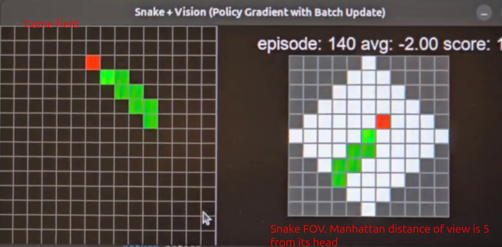

# Snake RL with fog of war

## Abstract

This project is built for reinforcement learning (RL) research using a variant of the classic Snake game. The key feature is the introduction of a **fog of war** mechanism. Unlike the standard Snake, the agent (the "snake") is only able to see within a configurable field of view (FOV), a certain radius around its head. This setup is aimed at exploring partial observability in RL.




The full game area is not provided to the model.

Model have only the local observation as shown in the FOV.


## Current Architecture

### Service Overview

**Clock Service** (`services/Clock/src/clock.py`)
- **Role**: Master coordinator and experiment tracker
- **Functions**: Controls training loop timing, manages shared memory, orchestrates episodes via semaphores, logs metrics to MLflow
- **Key Resources**: Creates `/game_state`, `/env_control`, `/inf_control` shared memory segments

**Environment Service** (`services/Env/src/env.py`) 
- **Role**: Snake game simulation engine
- **Functions**: Runs Snake game logic, processes actions, computes rewards, writes game state to shared memory
- **Features**: Configurable grid size, vision radius, and reward structure

**Inference Service** (`services/Inference/src/inf.py`)
- **Role**: Neural network agent with integrated training
- **Functions**: Runs SnakeNet (hyperopt-optimized architecture), implements REINFORCE algorithm, maintains replay buffer
- **Training**: On-policy learning with entropy regularization

### Communication Mechanism

**Shared Memory Architecture**: Services communicate via POSIX shared memory and semaphores for maximum performance:

- **`/game_state`**: Game state (reward, game_over, action) + vision data
- **`/env_control`**: Environment control (reset commands, episode stats)  
- **`/inf_control`**: Inference control (training triggers, loss metrics)

**Synchronization Flow**:
1. Clock releases semaphores → ENV updates game state, INF selects action
2. Services signal completion → Clock coordinates next step
3. Episode end → Clock triggers training in INF service

## Running Experiments

### Method 1: Docker Compose (Recommended for Production)

This method runs the full shared memory architecture in Docker containers with MLflow tracking.

#### Step 1: Build Base Image

First, build the base image containing PyTorch and shared dependencies:

```bash
cd services/
docker build -t korolaab/snake_rl_base:latest -f Dockerfile .
```

This will take 5-10 minutes as it downloads PyTorch and CUDA libraries.

#### Step 2: Build Service Images

Build the three service images:

```bash
# Build Clock service (master coordinator)
docker build -t localhost:5000/snake-rl/clock:latest -f Clock/Dockerfile Clock/

# Build Environment service (Snake game engine)
docker build -t localhost:5000/snake-rl/env:latest -f Env/Dockerfile Env/

# Build Inference service (RL agent)
docker build -t localhost:5000/snake-rl/inference:latest -f Inference/Dockerfile Inference/
```

#### Step 3: Run Experiment

Start all services with Docker Compose:

```bash
cd services/
docker compose up
```

The experiment will:
- Run for 3000 episodes (configurable in `docker-compose.yaml`)
- Log metrics to MLflow every episode
- Save model checkpoints every 50 episodes
- Store results in `./logs-storage/`

#### Step 4: Monitor Progress

Watch logs in real-time:

```bash
# All services
docker compose logs -f

# Specific service
docker compose logs -f clock
docker compose logs -f env
docker compose logs -f inference
```

Expected output:
```
clock-1 | [Clock] 100:eaten_apples=0 loss=-0.109 entropy_mean=1.098 frames=150 sum_reward=149
clock-1 | [Clock] 101:eaten_apples=1 loss=-0.107 entropy_mean=1.097 frames=153 sum_reward=153
```

#### Step 5: View Results

After the experiment completes, view MLflow metrics:

```bash
cd services/logs-storage/
mlflow ui --backend-store-uri file:///logs/mlruns
```

Open http://localhost:5000 to explore:
- Episode rewards over time
- Loss curves
- Entropy trends
- Eaten apples statistics

Model checkpoints are saved in `services/logs-storage/`:
```bash
ls -lh services/logs-storage/*.pth
```

#### Step 6: Stop Experiment

To stop the experiment early:

```bash
docker compose down
```

### Configuration Options

Edit `services/docker-compose.yaml` to customize:

**Clock Service:**
- `--max-episodes 3000` - Total episodes to run
- `--fps 0` - Game speed (0 = unlimited)
- `--vision-size 5` - Field of view radius

**Environment Service:**
- `--grid_width 11` - Grid width
- `--grid_height 11` - Grid height
- `--max-lifetime 10000` - Max steps per episode
- `--apple-speed 0.5` - Apple movement speed
- `--max-hunger-steps 150` - Steps before snake dies of hunger
- `--reward-config '{"alive": 1, "eat_food": 0, "game_over": 0}'` - Reward structure

**Inference Service:**
- `--learning-rate 0.001` - Neural network learning rate
- `--gamma 0.9` - Discount factor
- `--beta 0.1` - Entropy regularization weight

### Method 2: VSCode Debug Launch (Development)

**VSCode Debug Launch** (recommended for debugging):
```
Debug (Clock + Env + Inf)  # Launches all services with debugpy
```

**Manual Start Order**:
1. Clock service (creates shared memory resources)
2. Environment service (waits for Clock resources)
3. Inference service (waits for Clock resources)

**Cleanup**: Automatic shared memory cleanup via VSCode `clean-shm` task
