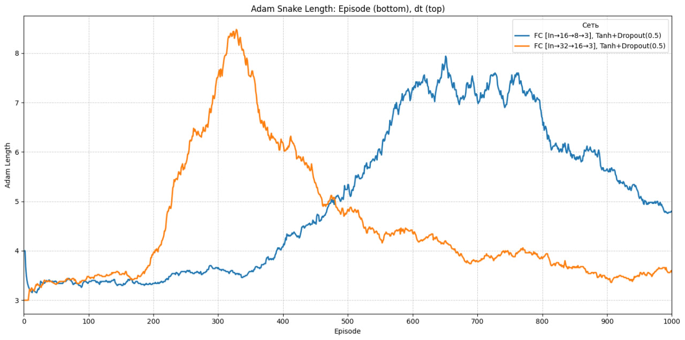

# 🐍 Snake RL: Observation Plan for Neural Network Performance

## 1. Context of the Problem

We are analyzing the training dynamics of different neural network architectures in a reinforcement learning (RL) setup using the classic Snake game environment. The RL agent is trained using the Adam optimizer and evaluated by the average snake length across episodes.

Two architectures are under investigation:

- **Small Network**: FC [In→16→8→3], Tanh + Dropout(0.5)
- **Large Network**: FC [In→32→16→3], Tanh + Dropout(0.5)

Initial findings show that while the large network learns faster and peaks earlier, it suffers from performance degradation over time. The smaller network improves more slowly but generalizes better and sustains performance longer. We aim to explore the causes of this divergence and improve training stability and generalization.

---

## 2. Observation & Experimentation Plan

### ✅ Step 1: Vary Grid Size
**Goal**: Observe how different environment complexities affect learning dynamics and overfitting behavior.

- Try multiple grid sizes: 5×5, 10×10, 15×15, 20×20
- Measure:
  - Time to convergence
  - Max snake length
  - Stability over episodes
- Hypothesis: Smaller grids may reduce the need for deep representations and lessen overfitting.

---

### 🎨 Step 2: Create Unusual Conditions in the Environment (Creative Step)
**Goal**: Stress-test generalization and adaptability.

Measure:
- How quickly networks adapt to new dynamics
- Whether catastrophic forgetting occurs
- Does any architecture generalize better?

---

## 3. Deliverables

- Graphs of training curves under different conditions
- Summary of findings with insights on stability and generalization
- Recommendations for robust network architectures

