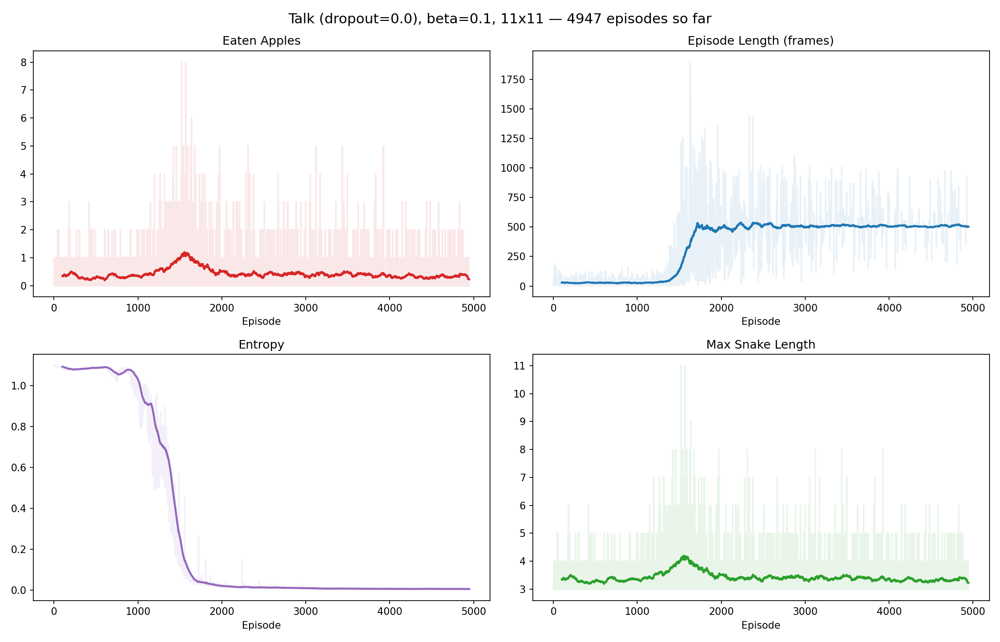

# Dual Snake 11x11 — Talk, beta=0.1, 10k episodes (stopped at 5311)

## Setup

- **Grid**: 11x11, vision_radius=5
- **Snakes**: 2, shared brain, coupled life/death
- **Apple**: running, speed=0.1
- **Talk vector**: 12-dim binary (STE), comm_dropout=0.0
- **Hunger limit**: 500 steps
- **Episodes**: 10000 target, stopped at 5311
- **LR**: 0.001, gamma=0.9, beta=0.1

## Results

### Key finding: more episodes don't help with entropy collapse

Same pattern as 3k run — entropy collapses to ~0 by episode 2000, after which policy is frozen:
- **ep 0-1300**: random policy, avg frames ~30
- **ep 1300-1500**: collision avoidance learned, frames jump to ~500
- **ep 1500-2000**: peak hunting (avg 0.8 apples/ep), entropy still ~0.1
- **ep 2000+**: entropy ~0.007, policy frozen, avg 0.4 apples/ep — no further improvement

10k episodes provide no benefit over 3k — the problem is entropy collapse, not episode budget.

### Next steps
- Entropy annealing (high beta early, decay over time)
- Adaptive beta based on current entropy
- PPO instead of REINFORCE

## Exact docker-compose

See [docker-compose.yaml](docker-compose.yaml) in this folder.
