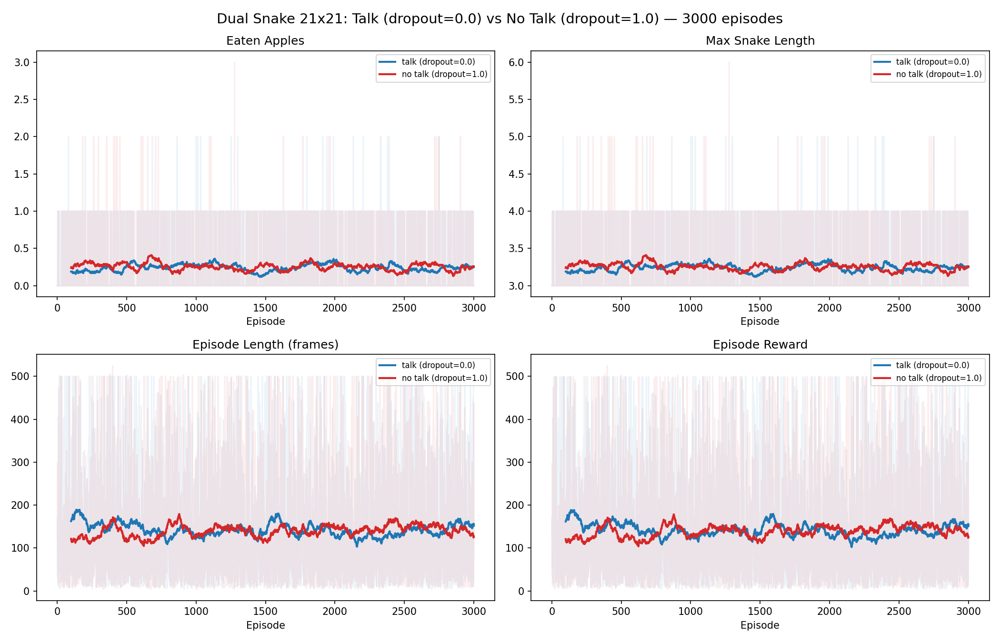

# Dual Snake 21x21 — Talk vs No Talk

## Setup

Same as 11x11 experiments except:
- **Grid**: 21x21 (was 11x11)

All other parameters identical:
- **Snakes**: 2, shared brain, coupled life/death
- **Apple**: running, speed=0.1
- **Talk vector**: 12-dim binary (STE)
- **Hunger limit**: 500 steps
- **Episodes**: 3000
- **LR**: 0.001, gamma=0.9, beta=0.1

Two runs:
1. `comm_dropout=0.0` (talk enabled)
2. `comm_dropout=1.0` (talk disabled)

## Results

### Conclusion

3000 episodes is completely insufficient for 21x21 grid. Neither variant showed any learning:
- Entropy stayed at ~1.09 (maximum ~1.099 for 3 actions) — policy remained random
- Avg frames ~100-150 — random walk until collision
- No collision avoidance learned (contrast with 11x11 where it emerged by ep ~1350)

The state space is ~4x larger (441 vs 121 cells), and snakes rarely encounter each other or the apple by random exploration. Needs either:
- Significantly more episodes (10k-30k+)
- Curriculum learning (start on smaller grid)
- Better exploration (higher beta, curiosity reward)

## Exact docker-compose

See [docker-compose.yaml](docker-compose.yaml) in this folder.
