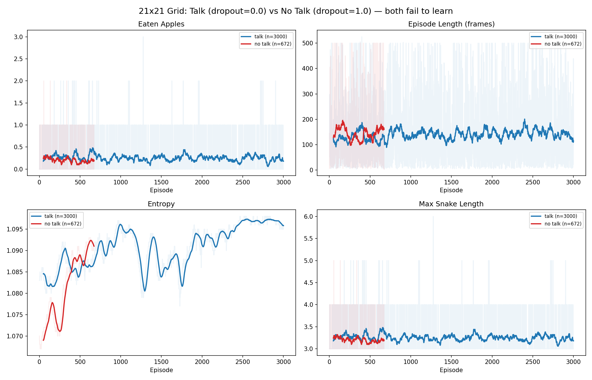

# Dual Snake 21x21 — Talk vs No Talk

## Setup

Same as 11x11 experiments except:
- **Grid**: 21x21 (was 11x11)

All other parameters identical:
- **Snakes**: 2, shared brain, coupled life/death
- **Apple**: running, speed=0.1
- **Talk vector**: 12-dim binary (STE)
- **Hunger limit**: 500 steps
- **LR**: 0.001, gamma=0.9, beta=0.1

## Results

### Both variants fail to learn

- Entropy stays at ~1.09 (max for 3 actions = log(3) ≈ 1.099) — policy remains fully random
- Average episode length ~100-150 frames (random collision death)
- No improvement in apple catching over 3000 episodes

### Why 21x21 fails where 11x11 succeeds

On 11x11, random walk occasionally reaches the hunger limit (500 steps), giving enough positive signal. On 21x21, snakes die from collisions much sooner with random policy (more space → more steps → more collision chances), and the entropy bonus (beta=0.1) dominates the loss, preventing any policy specialization.

### Possible fixes
- Lower beta (0.01 or entropy annealing)
- Increase max_hunger_steps to give more time
- Curriculum: start on small grid, increase
- Larger network / more episodes

## Logs

- `talk_log.txt`: 3000 episodes, comm_dropout=0.0
- `notalk_log.txt`: 672 episodes (interrupted), comm_dropout=1.0
- `docker-compose.yaml`: exact setup (comm_dropout=1.0 variant)
