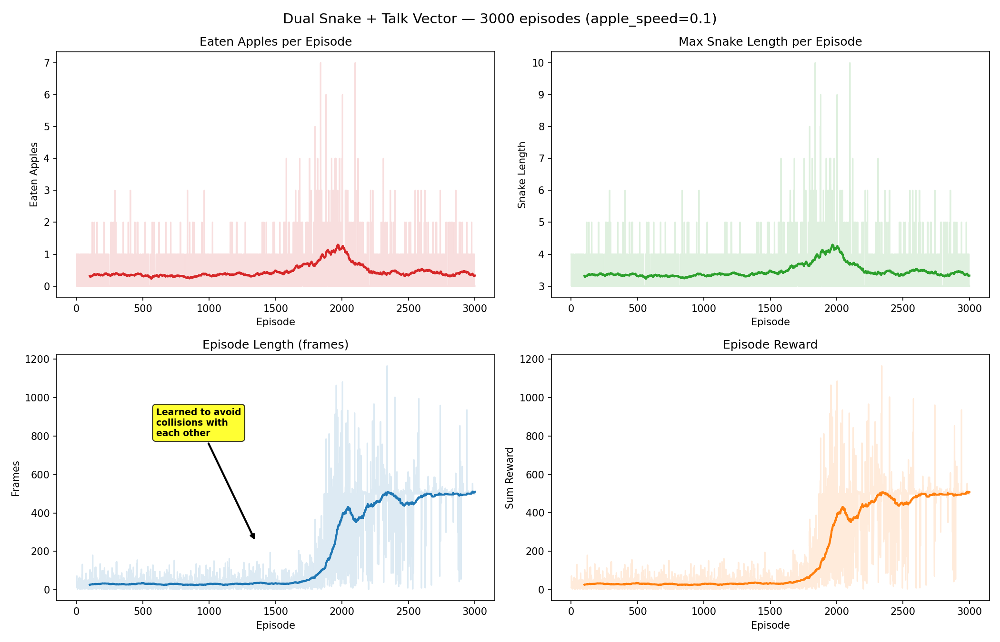

# Dual Snake + Talk Vector Communication

## Setup

- **Grid**: 11x11, vision_radius=5
- **Snakes**: 2, shared brain (SnakeNet), coupled life/death
- **Apple**: running, speed=0.1 (1 move per 10 ticks), escapes nearest head
- **Talk vector**: 12-dim binary (STE), snake1→snake2 each tick
- **Comm dropout**: 0.0 (full communication)
- **Hunger limit**: 500 steps without food → death
- **Episodes**: 3000
- **LR**: 0.001, gamma=0.9, beta=0.1
- **Network**: Linear(136→14)→Tanh→Linear(14→12)→Tanh→Dropout(0.3)→policy_head + talk_head

## Results

### Key observations

1. **Collision avoidance learned ~ep 1300-1500**: episode length jumps from ~30 to ~400+ frames
2. **Peak hunting ~ep 1500-2000**: avg 0.81 apples/episode, max 7 apples
3. **Entropy collapse ~ep 2000+**: entropy drops to ~0.004, policy becomes overly conservative
4. **Late game**: snakes survive to hunger limit (500 frames) but rarely catch apples

### Stats by block

| Episodes | Avg Apples | Avg Frames | Max Apples |
|----------|-----------|-----------|-----------|
| 0-500    | 0.34      | 30        | 3         |
| 500-1000 | 0.32      | 29        | 3         |
| 1000-1500| 0.39      | 32        | 2         |
| 1500-2000| **0.81**  | 136       | **7**     |
| 2000-2500| 0.48      | 444       | 7         |
| 2500-3000| 0.41      | **495**   | 3         |

## Exact docker-compose

See [docker-compose.yaml](docker-compose.yaml) in this folder.
