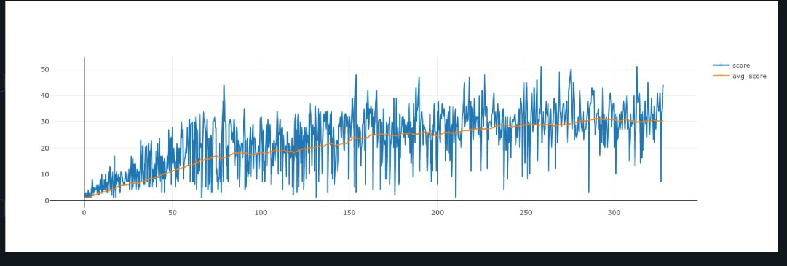

# Snake AI with Reinforcement Learning

This project implements a Snake game with an AI agent trained using Policy Gradient reinforcement learning.

## Project Structure

```
snake-ai/
├── main.py            # Main entry point
├── config.py          # Game configuration and constants
├── game.py            # Snake game logic
├── rendering.py       # Pygame rendering functions
├── agent.py           # Reinforcement learning agent
├── network.py         # Neural network architecture
└── README.md          # This file
```

## Requirements

- Python 3.6+
- PyTorch
- Pygame
- NumPy
- torchsummary

# Example

 - avg score vs episode

https://youtu.be/INKRgVGEHX0 Here is the example how trained agent plays the game

## Features

- Snake game with wrapping boundaries
- AI agent using Policy Gradient (REINFORCE algorithm)
- Visual display of the snake's field of view
- Batch updates for more stable learning
- Epsilon-greedy exploration strategy
- Entropy regularization for better exploration

## Controls

- Left/Right arrow keys: Override AI and change direction
- Up arrow key: Toggle between fast and slow game speed

## Training Process

The agent learns to play Snake by:
1. Observing the game state (snake position, food position)
2. Making movement decisions based on a neural network policy
3. Receiving rewards for collecting food and staying alive
4. Updating the policy based on the rewards received

## How to Run

```
python main.py
```

## Performance

The agent's performance is tracked in a CSV file showing the score for each episode. The average score displayed in the game window indicates the agent's learning progress over time.
